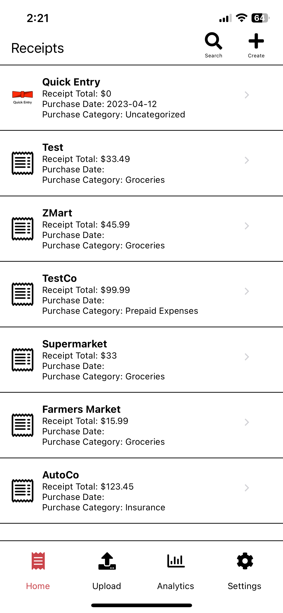
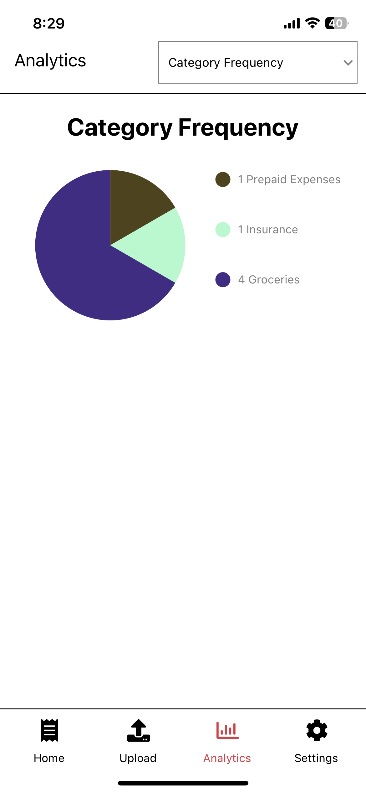
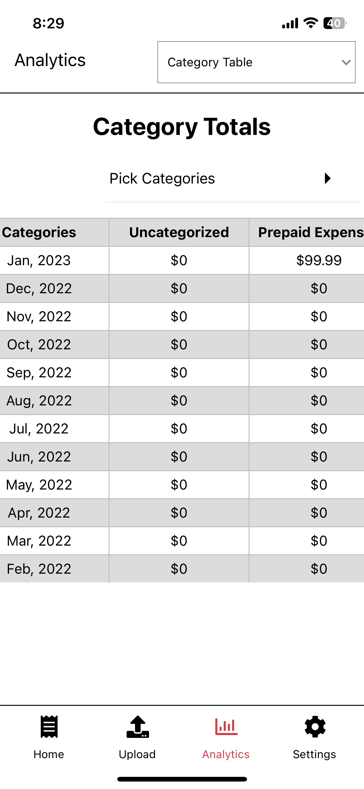
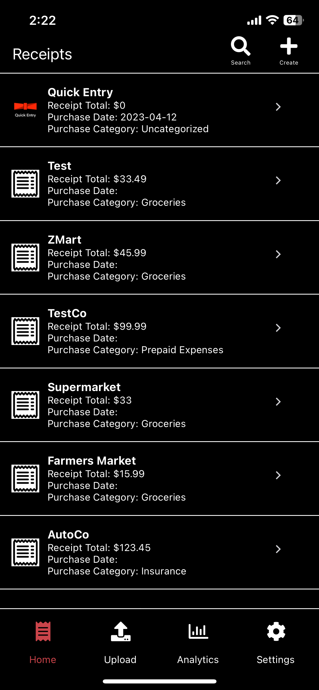

## Receipts Mobile

This is a react native app to store receipts. It runs using react native

## Running
Run with expo `expo start` 

Run Prebuild: `npx expo prebuild`

Build with eas `eas build --profile production --platform ios`

Build with eas `eas build --profile production --platform android`

Build internally with eas `eas build --profile preview --platform ios`
## Submitting
Using eas `eas submit -p ios`

or on android `eas submit --platform android `

## Images






## Promo Text
```
Say goodbye to the hassle of paper receipts and hello to effortless organization with Ribbon Receipts!
```

## Description
```
Welcome to our online receipt storage platform! With our app, you can easily store and organize all of your receipts in one convenient place. No more lost receipts or cluttered filing cabinets - simply snap a photo of your receipt and upload it to our app. Our platform uses advanced technology to extract key information from your receipts, such as the date, vendor, and total amount, making it easy to search and filter your receipts by these criteria.

In addition to storing your receipts, our platform also provides powerful tools for analyzing your spending habits. You can view detailed reports on your spending by category, vendor, and time period, helping you make more informed decisions about your finances.

Our app is designed with security in mind. All of your data is stored securely, and we never share your information with third parties.

Whether you're a busy professional or just looking for a better way to manage your receipts, our online storage platform has you covered. Sign up today and start enjoying the benefits of effortless receipt management!
```

## IOS App
https://apps.apple.com/us/app/ribbon-receipts/id1662296584